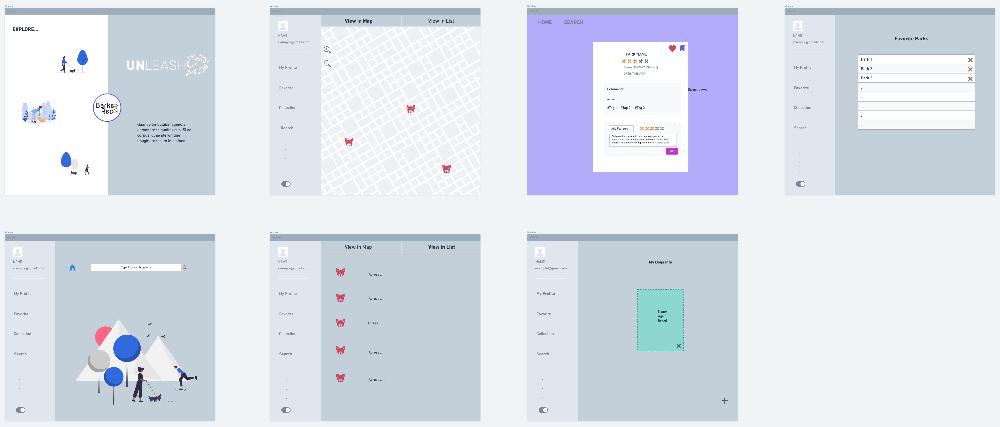
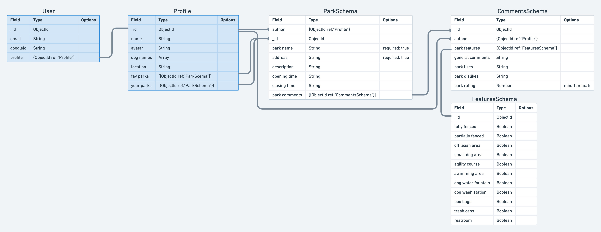
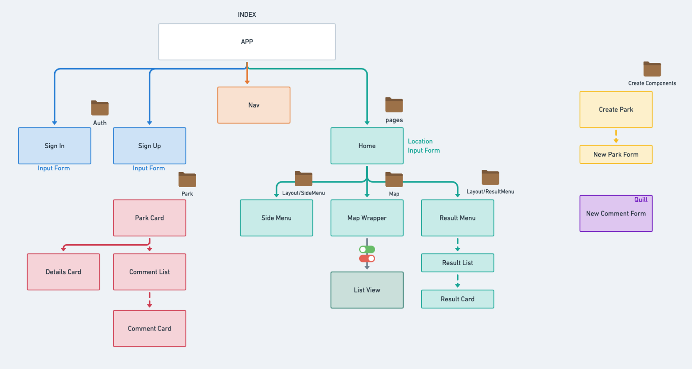
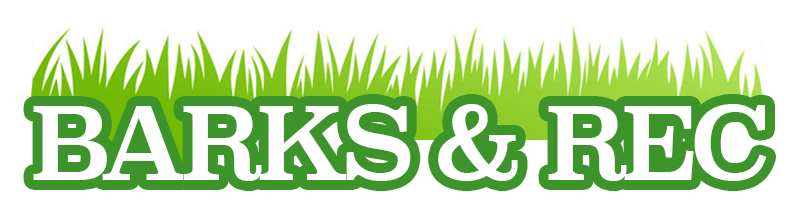

UNleash is a MERN stack application designed to help people locate dog parks in their area and enables users to connect with the communities that exist in these dog friendly public spaces. 

## About

Dogs are an integral part of an increasing number of American households. This is nothing new, however, in the past two decades, dog ownership has grown at a faster rate than ever before. Growing from 68 million pet dogs in 2000 to over 90 million currently in 2021. Many different markets have emerged to target the unique demands of the growing dog owner demographic. Dog ownership is not only changing the way we shop, it is also changing the way we design our towns and cities. Dog parks are increasing in number across the United States, from 2010 to 2015, the number of dog parks increased 20%, and has continued to grow at approximately 5% annually. Dog parks are not only valued by dog owners! While only about 40% of American households own dogs, according to the National Recreation and Park Association (NRPA), 91% of Americans believe dog parks provide benefits to the communities they serve. As of 2018, 55% of park and recreation agencies had at least one dog park, and they are the fastest growing amenity these agencies offer. Americans list the top three benefits a dog park can have on a community as:

60% believe they give dogs a safe space to exercise and roam around freely.
39% say they allow dogs to socialize with other dogs.
36% think they allow owners a chance to be physically active with their pet

Availability of dog parks is popular amongst all demographics, but most popular with millennials, 94% of whom think dog parks provide benefits to communities, followed by 92% of Gen Xers and 89% of baby boomers. It is clear that our nation’s increased interest in our dogs and the desire to provide public places for people and their dog’s to enjoy is not just a passing fad amongst a given generation but rather seems to be something a divided America is uniting behind! 

At Barks & Rec Inc, we see this as a positive trend and seek to get more dog owners involved with their local dog parks and the communities that develop within them! It is with pride that we introduce UNleash: Dog Run App! 

UNleash connects users with dog parks near their current location using the Google Maps Places API, as well as pulling from our own user generated database. Users can see detailed lists of park amenities and any important details about the park, while also having access to user reviews and the ability to leave reviews on parks they have visited. UNleash aims to build strong, healthy and loving communities around the growing number of dog parks in our neighborhoods. Come run with us!

## Screenshots

## Getting Started

The UNleash app is deployed [HERE](https://barks-rec-unleash.herokuapp.com/)

## Built With

* [MongoDB](https://www.mongodb.com/)
* [Mongoose](https://mongoosejs.com/)
* [Express](https://expressjs.com/)
* [React](https://reactjs.org/)
* [Node.js](https://nodejs.org/)
* [React Google Maps API](https://www.npmjs.com/package/@react-google-maps/api)
* [TomTom Geocode API](https://developer.tomtom.com/content/search-api-explorer#/Geocoding/get_search__versionNumber__geocode__query___ext_)
* [TomTom Points of Interest Search API](https://developer.tomtom.com/content/search-api-explorer#/Search/get_search__versionNumber__poiSearch__query___ext_)
* [Material-UI](https://material-ui.com/)
* [LottieFiles](https://lottiefiles.com/)

## Authors

**Ian Terada**
**John Nelson-Alden**
**Shunuan Hu** 

## Wireframe

## ERD

## Component Map

## Pseudocode and User Stories

* AAU I should be able to set the parameters for which dog parks display based on city, state, etc..
* AAU I want to be able to add park locations
* AAU I want to be able to add comments on parks
* AAU I want to be able to see a page of information about each park that I can click on from a result page
* AAU I want map to center on my location on page load
* AAU I want to be able to enter a location by name, keyword or address, and the map to recenter on desired location and plot the location of dog parks in the area.
* AAU I want to be able to see a page of information about each park that I can click on from a result page
* AAU I want to be able to add new park locations.
* AAU I want to be able to edit parks I created
* AAU I want to be able to add comments on parks
* AAU I should be able to edit my comments about the park
* Users can edit and delete comments they have left on parks other users have added.

## Next Steps

* 
* 

